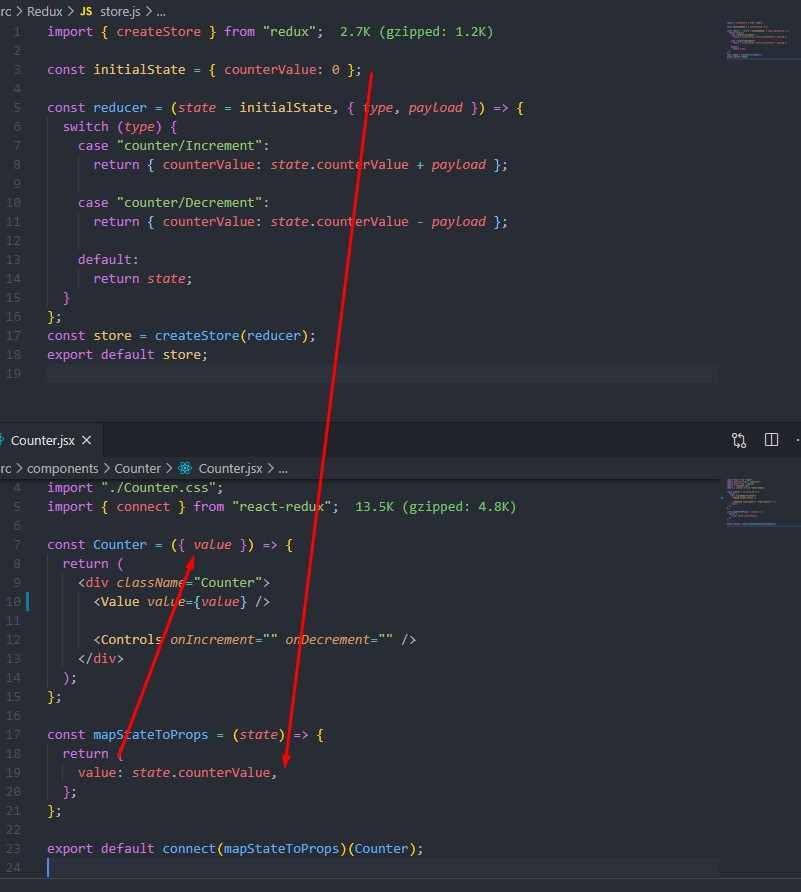

# Навигация

## Основы Redux

1. [Basic](#basic)

2. [Create_action](#create_action)

3. [Action_creator](#action_creator)

4. [Reducer](#reducer)

## Практика

[Start](#start)

## Counter

2. [Counter](#counter)

3. [Counter-actions-creators](#counter-actions-creators)

4. [Switch-cases](#switch-cases)

5. [Remove-state-and-methods-in-the-component](#remove-state-and-methods-in-the-component)

6. [Store-access-for-a-component](#Store-access-for-a-component)

   - [Get-data-from-storage-in-a-counter](#Get-data-from-storage-in-a-counter)

### Basic

Для понимания основ работы redux:

1. Создать папку redux, а в ней файл `store.js`;
2. В `store.js`:

- `import { createStore } from "redux"`;
- `const reducer = (state = {}, action) => state;`
- `const store = createStore(reducer);`
- `export default store;`

Store - это js-объект, который содержит методы, позволяющие получить (`getState`) и изменить (`dispatch`) состояние.

`Dispatch` принимает `action` в качестве параметра, который изменяет состояние и доставляет его в reducer
В объекте `state` редьюсера можно указать дефолтное значение для стейта

#### Create_action

Создадим в папке `redux` файл `actions.js` и добавим в него action:

```
export const action = {
  type: "MY_ACTION",
  payload: "my new payload"
};

export default action;

```

- `type` - обязательное свойство, определяющее имя экшна, по которому далее будет происходить поиск
- `payload` - полезная нагрузка, в которой описываются действия, которые изменяют состояние

Теперь можно получить данные из объекта action в любом компоненте таким образом: `console.log(store.dispatch(action));`

#### Action_creator

Генераторы экшенов (Action Creators) — функции, которые создают экшены.

В Redux генераторы экшенов (action creators) просто возвращают action:

```
export const action = (value) => ({
  type: "MY_ACTION",
  payload: value,
});

```

Такой подход позволяет динамически изменять `payload`

#### Reducer

Чтобы action мог обновиться в store, он должен дойти до редьюсера. `Reducer` - чистая функция, работающая только с синхронным кодом. Он принимает предыдущий `state` и `action`, на основе чего вычистляет и возвращает новое состояние.

`(previousState, action) => newState`

### Start

1. Установить state-manager redux `npm i redux`
2. Установить пакет для связывания Redux + React `npm i react-redux`
3. В корневом `index.js` сделать импорты `createStore` и `Provider`. Обернуть приложение в компонент`Provider` и передать `store` пропсом:

   ```
   import { createStore } from 'redux';
   import { Provider } from 'react-redux';

   const reducer = (state = {}, action) => state;
   const store = createStore(reducer);

   <Provider store={store}>
   <App />
   </Provider>
   ```

   Теперь store будем доступен по всему приложению вне зависимости от уровня вложенности компонента

## Counter

Переведем компонент <a href='./src/components/Counter/CounterState.jsx'> Counter </a> на redux

1. Пропишем в `store.js` initialState - начальное значение стейта и редьюсер, которые вернет новый стейт после экшна:

```
const initialState = {};

const reducer = (state = initialState, action) => {
  return state;
};
```

#### Counter-actions-creators

2. Пропишем в `actions.js` 2 экшн-креэйтора для увеличения и уменьшения значения счетчика:

```
export const increment = (value) => ({
  type: "counter/Increment",
  payload: value + 1,
});

export const decrement = (value) => ({
  type: "counter/Decrement",
  payload: value - 1,
});
```

#### Switch-cases

Так как редьюсер различает экшны по полю `type`, для уточнения значения этого поля сделаем ветвление в `store.js` при помощи инструкции `switch`. Также предварительно инициализируем начальное значение счетчика:

```

// Инициализируем стейт
const initialState = { counterValue: 0 };

const reducer = (state = initialState, {type, payload}) => {
  switch (type) {

    // Если type = counter/Increment, увеличиваем counterValue на
    // значение action.payload

    case "counter/Increment":
      return { counterValue: state.counterValue + payload };

    // Если type = counter/Decrement, уменьшаем counterValue на
    // значение action.payload

    case "counter/Decrement":
      return { counterValue: state.counterValue - payload };

    // Если reducer получит action, который не может обработать, вернем state
    default:
      return state;
  }
};
```

#### Remove-state-and-methods-in-the-component

Все методы прописаны в Редакса, поэтому удаляем их из компонента. Изначально он <a href="./src/components/Counter/CounterState.jsx">выглядел так</a>, а теперь внутри останется только jsx-разметка:

```
const Counter = () => {
  return (
    <div className="Counter">
      <Value value="" />

      <Controls onIncrement="" onDecrement="" />
    </div>
  );
};
```

#### Store-access-for-a-component

Для доступа к хранилищу внутри компонента можно использовать HOC connect:

`connect(mapStateToProps, mapDispatchToProps)(Component)`

Объявление `mapStateToProps`:

```
 const mapStateToProps = (state, props) => ({
     state: data
   });
```

где:

- `state` - весь стейт, хранящийся в `store`,
- `props` - та часть стора, которую нужно записать в пропсы.

Объявление `mapDispatchToProps`:

```
const mapDispatchToProps = dispatch => ({
  fn: data => dispatch(fn(text)),
});
```

2. `mapDispatchToProps(dispatch, fn)`, где:

   - `dispatch` - метод для отправки экшна
   - `fn` - функция, изменяющая `store`
   - `data` - данные, которые нужно изменить при экшне

#### Get-data-from-storage-in-a-counter

Получим данные из хранилища в компоненте Counter. Для этого:

1. Сделаем в компоненте импорт - `import {connect} from 'react-redux`
2. Пропишем метод mapStateToProps для доступа к стейту и возьмем оттуда значение свойства counterValue

```
const mapStateToProps = (state) => {
  return {
    value: state.counterValue,
  };
};
```



3. При экспорте компонента обернем его в HOC connect, передав ему параметры для связи с хранилищем - `export default connect()(Counter)`
