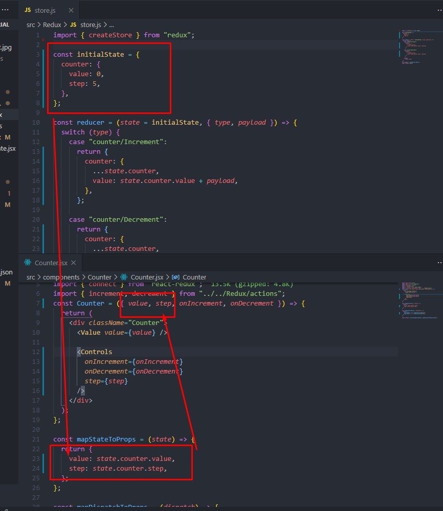
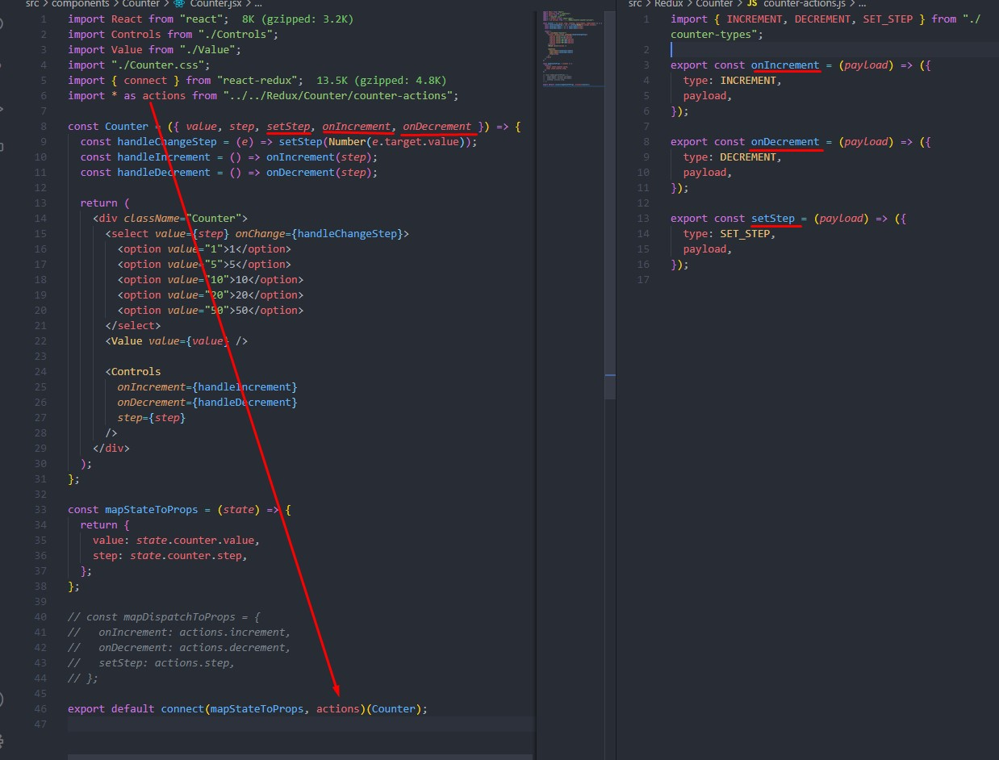
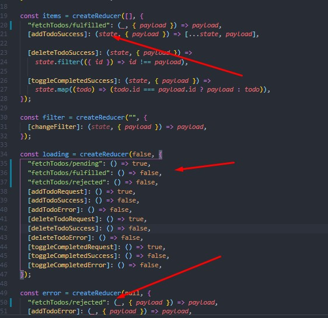

# Навигация

## Основы Redux

1. [Basic](#basic)

2. [Создание экшнов](#create_action)

3. [Action_creators - фабрики экшнов](#action_creator)

4. [Reducer](#reducer)

## Практика

[Start](#start)

- npm
- Provider
- DevTools : способы подключения

## Counter

2. [Counter-actions-creators](#counter-actions-creators)

3. [Switch-cases](#switch-cases)

4. [Remove-state-and-methods-in-the-component](#remove-state-and-methods-in-the-component)

5. [Store-access-for-a-component](#Store-access-for-a-component)

   - MapStateToProps: [Get-data-from-storage-in-a-counter](#Get-data-from-storage-in-a-counter)
   - MapDispatchToProps: [Write-changes-to-storage](#Write-changes-to-storage)

6. [Composition-reducers](#Composition-reducers)

7. [AddSetStep](#AddSetStep)

8. [Refactoring](#Refactoring)

- [8.1 Переписываем функции и избавляемся от диспатчей в mapDispatchToProps](#Refactoring-Counter-Functions)

## [Redux_Toolkit](#Redux_Toolkit)

- [ConfigureStore](#ConfigureStore)
- [Middlware](#Middlware)
- [createAction](#createAction)
- [CreateReducer](#CreateReducer)
- [PersistStore](#PersistStore)
- [Slices](#Slices)
- [Презентационный компонент и контейнер](#Презентационный-компонент-и-контейнер)

---

### [TODOS: список задач](#Todos)

- [Обзор компонентов](#Обзор-компонентов)
- [Подключение локальной БД](#Подключение-локальной-БД)
- [CRUD-операции](#CRUD-операции)
- [Code-splitting: Вынос запросов на бекенд в файл с api-сервисами](#Code-splitting)
- [Перевод Todos на Redux(проектирование)](<#Перевод-Todos-на-Redux(проектирование)>)
- [Перевод Todos на Redux(логика редьюсеров)](<#Перевод-Todos-на-Redux(логика-редьюсеров)>)

  - [AddTodo](#AddTodo)
  - [DeleteTodo](#DeleteTodo)
  - [ToggleCompleted](#ToggleCompleted)
  - [Filter](#Filter)
  - [Перевод Todos на Toolkit](#Перевод-Todos-на-Toolkit)

---

## [Асинхронный Redux](#Асинхронный-Redux)

- [Кастомные миддлвары](#Кастомные-миддлвары)
- [Миддлвар thunk для работы с асинхронными операциями](#Миддлвар-thunk-для-работы-с-асинхронными-операциями)
- [Практика работы с асинхронными запросами в Redux](#Практика-работы-с-асинхронными-запросами-в-Redux)
  1. [Добавление Todo](#Добавление-Todo)
  2. [Удаление Todo](#Удаление-Todo)
  3. [Toggle Todo](#Toggle-Todo)
  4. [Fetch Todos](#fetch-todos)
  5. [CreateAsyncThunk](#CreateAsyncThunk)
  6. [Пример с хуком useDispatch вместо mapDispatchToProps](#Пример-с-хуком-useDispatch-вместо-mapDispatchToProps)
  7. [Пример с useSelector вместо mapStateToProps](#Пример-с-useSelector-вместо-mapStateToProps)
  8. [Редьюсер loadind](#Редьюсер-loadind)
  9. [Добавление спиннера](#Добавление-спиннера)

---

## [Селекторы и библиотека reselect](#Селекторы-и-библиотека-reselect)

- [Мемоизация селекторов](#Мемоизация-селекторов)
- [Мемоизация с помощью хука useMemo](#Мемоизация-с-помощью-хука-useMemo)
- [Реэкспорты](#Реэкспорты)

---

## [Регистрация и логин](#Регистрация-и-логин)

- [Структура компонентов](#Структура-компонентов)
- [Добавление структуры данных для авторизации в Redux](#Добавление-данных-для-авторизации-в-Redux)
- [Прописываем экшны](#Прописываем-экшны)
- [Регистрация пользователя](#Регистрация-пользователя)
- [Логинизация пользователя](#Логинизация-пользователя)
- [Реализация отклика интерфейса при регистрации и логинизации](#Реализация-отклика-интерфейса-при-регистрации-и-логинизации)
- [Запись токена в заголовок авторизации](#Запись-токена-в-заголовок-авторизации)
- [Функционал для Logout](#Функционал-для-Logout)
- [Рефреш залогиненного пользователя](#рефреш-залогиненного-пользователя)
- [Функция для обработки ошибок (сокращение кода)](#функция-для-обработки-ошибок)
- [PrivateRoute для приватных маршрутов](#PrivateRoute-для-приватных-маршрутов)
- [Скрытие страницы с заметками из навигации](#Скрытие-страницы-с-заметками-из-навигации)
- [Скрытие маршрутов login и register после авторизации (PrivateRoute)](#Скрытие-маршрутов-login-и-register-после-авторизации)
- [Настройка последовательности рендеринга todos и current (данные о текущем пользователе)](#Настройка-последовательности-рендеринга-todos-и-current)

---

### Hook useReducer

- [Как использовать](#useReducer)

Для понимания основ работы redux:

1. Создать папку redux, а в ней файл `store.js`;
2. В `store.js`:

- `import { createStore } from "redux"`;
- `const reducer = (state = {}, action) => state;`
- `const store = createStore(reducer);`
- `export default store;`

Store - это js-объект, который содержит методы, позволяющие получить (`getState`) и изменить (`dispatch`) состояние.

`Dispatch` принимает `action` в качестве параметра, который изменяет состояние и доставляет его в reducer
В объекте `state` редьюсера можно указать дефолтное значение для стейта

#### Create_action

Создадим в папке `redux` файл `actions.js` и добавим в него action:

```
export const action = {
  type: "MY_ACTION",
  payload: "my new payload"
};

export default action;

```

- `type` - обязательное свойство, определяющее имя экшна, по которому далее будет происходить поиск
- `payload` - полезная нагрузка, в которой описываются действия, которые изменяют состояние

Теперь можно получить данные из объекта action в любом компоненте таким образом: `console.log(store.dispatch(action));`

#### Action_creator

Генераторы экшенов (Action Creators) — функции, которые создают и возвращают экшны

```
export const action = (value) => ({
  type: "MY_ACTION",
  payload: value,
});

```

Такой подход позволяет динамически изменять `payload`

#### Reducer

Чтобы action мог обновиться в store, он должен дойти до редьюсера. `Reducer` - чистая функция, работающая только с синхронным кодом. Он принимает предыдущий `state` и `action`, на основе чего вычистляет и возвращает новое состояние.

`(previousState, action) => newState`

### Start

1. Установить state-manager redux `npm i redux`
2. Установить пакет для связывания Redux + React `npm i react-redux`
3. В корневом `index.js` сделать импорты `Provider`. Обернуть приложение в компонент`Provider`, заимпортировать store и передать его пропсом:

   ```
   import { Provider } from 'react-redux';
   import store from "./Redux/store";

   <Provider store={store}>
   <App />
   </Provider>
   ```

4. Добавить DevTools для работы с Redux:

- 4.1 Установить в браузере расширение Redux DevTools
- 4.2 Добавить в проект пакет <a href="https://www.npmjs.com/package/redux-devtools-extension">Redux DevTools Extension's </a> `npm install --save redux-devtools-extension`
- 4.3 Добавить `store.js` импорт `import { composeWithDevTools } from "redux-devtools-extension"`
- 4.4 Добавить вызов `composeWithDevTools` вторым аргументом в `createStore`
- `const store = createStore(reducer, composeWithDevTools())`

Также есть другой способ подключить Redux DevTools:

```
const store = createStore(
  reducer,
  window.__REDUX_DEVTOOLS_EXTENSION__ && window.__REDUX_DEVTOOLS_EXTENSION__()
);
```

При таком варианте устанавливать npm-пакет `redux-devtools-extension` не нужно.

## Counter

Переведем компонент [Counter](./src/components/Counter/CounterStateComponent.jsx) на redux

1. Пропишем в `store.js` initialState - начальное значение стейта и редьюсер, которые вернет новый стейт после экшна:

```
const initialState = {};

const reducer = (state = initialState, action) => {
  return state;
};
```

#### Counter-actions-creators

2. Пропишем в `actions.js` 2 экшн-креэйтора для увеличения и уменьшения значения счетчика:

```
export const increment = (value) => ({
  type: "counter/Increment",
  payload: value
});

export const decrement = (value) => ({
  type: "counter/Decrement",
  payload: value
});
```

**p.s [Позднее сдалем рефакторинг](#refactoring)**

#### Switch-cases

Так как редьюсер различает экшны по полю `type`, для уточнения значения этого поля сделаем ветвление в `store.js` при помощи инструкции `switch`. Также предварительно инициализируем начальное значение счетчика:

```

// Инициализируем стейт, сразу же указывая параметры счетчика в отдельном объекте. Это делается для обеспечения модульности и удобства, ведь в дальнейшем в стейте будет лежать не только counter
const initialState = {
  counter: {
    value: 0,
    step: 5,
  },
};

const reducer = (state = initialState, {type, payload}) => {
  switch (type) {

    // Если type = counter/Increment, увеличиваем value на
    // значение action.payload, предварительно распыляя значение step, так как нам не нужно его менять

    case "counter/Increment":
      return {
        ...state,
        counter: {
          ...state.counter,
          value: state.counter.value + payload,
        },
      };
    // Если type = counter/Decrement, уменьшаем value на
    // значение action.payload

     case "counter/Decrement":
      return {
        ...state,
        counter: {
          ...state.counter,
          value: state.counter.value - payload,
        },
      };

    // Если reducer получит action, который не может обработать, вернем state
    default:
      return state;
  }
};
```

_Примечание: пока у нас 1 state для всех потенциальных операций. Это сделано для ознакомления, но на практике не очень удобно, так как при любом обновлении приходится распылять state, чтобы не затереть значения свойств, которые не диспатчатся. [Позднее перепишем код](#Composition-reducers) так, чтобы для каждого типа операций был отдельный редьюсер_

#### Remove-state-and-methods-in-the-component

Все методы прописаны в Редаксе, поэтому удаляем их из компонента. Изначально он [выглядел так](src/components/Counter/CounterStateComponent.jsx), а теперь внутри останется только jsx-разметка:

```
const Counter = () => {
  return (
    <div className="Counter">
      <Value value="" />

      <Controls onIncrement="" onDecrement="" />
    </div>
  );
};
```

#### Store-access-for-a-component

Для доступа к хранилищу внутри компонента можно использовать HOC connect, который нужно заимпортировать в тело компонента: `import {connect} from 'react-redux`

Синтаксис:
`connect(mapStateToProps, mapDispatchToProps)(Component)`

Объявление `mapStateToProps`:

```
 const mapStateToProps = (state, props) => ({
     state: data
   });
```

где:

- `state` - весь стейт, хранящийся в `store`,
- `props` - та часть стора, которую нужно записать в пропсы.

Объявление `mapDispatchToProps`:

```
const mapDispatchToProps = dispatch => ({
  fn: data => dispatch(fn(text)),
});
```

2. `mapDispatchToProps(dispatch, fn)`, где:

   - `dispatch` - метод для отправки экшна
   - `fn` - функция, изменяющая `store`
   - `data` - данные, которые нужно изменить при экшне

#### Get-data-from-storage-in-a-counter

Пропишем метод mapStateToProps в компоненте `Counter` для доступа к стейту и извлечем оттуда значение свойства `value` и `step`

```
const mapStateToProps = (state) => {
  return {
    value: state.counter.value,
    step: state.counter.step
  };
};
```



При экспорте компонента обернем его в HOC connect, передав ему параметры для связи с хранилищем - `export default connect(mapStateToProps)(Counter)`

#### Write-changes-to-storage

Обработаем изменения счетчика. Для этого потребуется:

1. Заимпортировать в компонент [ранее созданные action-creators](#Counter-actions-creators)
2. Прописать метод `MapDispatchToProps`, который примет функцию и вернет `dispatch` с соответствующим экшном
3. Передать в анонимную функцию параметром `value` и указать это `value` как аргумент для экшн-креэйторов increment и decrement

```
 const mapDispatchToProps = (dispatch) => {
 return {
  onIncrement: (value) => dispatch(increment(value)),
  onDecrement: (value) => dispatch(decrement(value)),
 }
};
export default connect(mapStateToProps, mapDispatchToProps)(Counter);
```

4. Прокинуть `OnIncrement` и `OnDecrement` в пропсы компонента
5. Прокинуть в компонент controls функции `onIncrement` и `onDecrement`, указав step как аргумент
6. Передать `MapDispatchToProps` 2-м аргументом в `HOC connect`


Теперь начальное значение счетчика и step можно изменять динамически в хранилище

#### Composition-reducers

При масштабировании приложения поддержка стейта в одном редьюсере становится сложнее и запутаннее из за глубины вложеннсоти и многочисленности свойств, поэтому лучше использовать несколько редьюсеров, комбинируя их с помощью функции `combineReducers`. Если [раньше у нас был один initial state для всех редьюсеров](#Switch-cases), то теперь будет отдельный для конкретного типа операций. В итоге initialState и reducer для счетчика будет выглядеть следующим образом:

```

// Создаем initialState для счетчика
const counterInitialState = {
  value: 10,
  step: 15,
};

const counterReducer = (state = counterInitialState, { type, payload }) => {
  switch (type) {
    case "counter/Increment":
      return {
     // Распыляем state на случай, если в будущем изменится значение step

        ...state,
        value: state.value + payload,
      };

    case "counter/Decrement":
      return {
        ...state,
        value: state.value - payload,
      };

    default:
      return state;
  }
};

//  Инициализируем корневой редьюсер и записываем его
const rootReducer = combineReducers({
  counter: counterReducer,
});

// Передаем rootReducer в функцию createStore
const store = createStore(
  rootReducer,
  window.__REDUX_DEVTOOLS_EXTENSION__ && window.__REDUX_DEVTOOLS_EXTENSION__()
);

```

Счетчик работает, но нам все еще нужно распылять state, так как если этого не делать, а значение `step` изменится, логика сломается. Чтобы не распылать стейт, можем сделать отдельные редьюсеры для свойств `value` и `step`, объединив их в counterReducer через функцию `combineReducer`, а его в свою очередь через еще один `combineReducer` в `rootReducer`, где будут храниться все части стейта приложения, и этот rootReducer уже передать аргументов в функцию createStore:

```
const valueReducer = (state = 0, { type, payload }) => {
  switch (type) {
    case "counter/Increment":
      return state + payload;

    case "counter/Decrement":
      return state - payload;

    default:
      return state;
  }
};

const stepReducer = (state = 5, action) => state;

const counterReducer = combineReducers({
  value: valueReducer,
  step: stepReducer,
});

const rootReducer = combineReducers({
  counter: counterReducer,
});

const store = createStore(
  rootReducer,
  window.__REDUX_DEVTOOLS_EXTENSION__ && window.__REDUX_DEVTOOLS_EXTENSION__()
);
```

Как видно, теперь редьюсеры максимально плоские и ничего распылять не нужно.

### AddSetStep

Самую малость усложним приложение, чтобы пользователь мог динамически менять `step` счетчика через интерфейс:

1. Добавим в `Counter.jsx` разметку списка `select`:

```
<select value={step} onChange={handleChangeStep}>
        <option value="1">1</option>
        <option value="5">5</option>
        <option value="10">10</option>
        <option value="20">20</option>
        <option value="50">50</option>
      </select>
```

2. Добавим в `actions.js` action-creator для поля `step`:

`export const step = (value) => ({ type: actions/setStep, payload: value, }); `

3. Перепишем stepReducer на такой вид:

```
const stepReducer = (state = 1, { type, payload }) => {
  switch (type) {
    case SET_STEP:
      return payload;

    default:
      return state;
  }
};
```

4. Добавим в `Counter.jsx` импорт экшн-криейтора `step`
5. Добавим новый диспатч в `mapStateToProps`:

`setStep: (value) => dispatch(step(value))`

6. В теле компонента перед `return` пропишем функцию, которая принимает `setStep` и возвращает функцию setStep с `e.target.value` и сразу же приведем `value` к числу, т.к. `select` возвращает строку:

`const handleChangeStep = (e) => setStep(Number(e.target.value))`

7. Передадим эту функцию в select на событие onChange и пропишем `step` в качестве `value`:

   `<select value={step} onChange={handleChangeStep}>`

### Refactoring

Если логика Redux прописана в одном файле, при масштабировании приложения возникнут сложности с поддержкой. Чтобы этого избежать, нужно разделить код на смысловые модули:

1. Создадим в папке `Redux` папку `Counter`
2. В папку `Counter` добавим файл `counter-actions.js` и перенесем в него [прописанные ранее экшн-креэйторы](#Counter-actions-creators) из файла `actions.js`
3. В папку `Counter` добавим файл `counter-reducer.js` и перенесем в него редьюсеры из `store.js`

```
import { combineReducers } from "redux";
import actionTypes from "./counter-types";

const valueReducer = (state = 10, { type, payload }) => {
  switch (type) {
    case "counter/Increment":
      return state + payload;

    case "counter/Decrement":
      return state - payload;

    default:
      return state;
  }
};

const stepReducer = (state = 5, action) => state;

export default combineReducers({
  value: valueReducer,
  step: stepReducer,
});

```

4. Заимпортируем редьюсер из `counter-reducer.js` в `store.js`

5. В папку `Counter` добавим файл `actions-types.js`, где зафиксируем типы экшнов

```
export const INCREMENT = "counter/Increment";
export const DECREMENT = "counter/Decrement";
```

после чего зампортируем эти данные в `counter-actions.js` и `counter-reducer.js` и будем использовать имена переменных вместо `counter/Increment` и `counter/Decrement`.

Так как вся логика счетчика уехала в [counter-reducer.js](/src/Redux/Counter/counter-reducer.js), хранилище [store.js](./src/Redux/store.js) стало куда чище:

```
import { createStore, combineReducers } from "redux";
import counterReducer from "./Counter/counter-reducer";

const rootReducer = combineReducers({
  counter: counterReducer,
});

const store = createStore(
  rootReducer,
  window.__REDUX_DEVTOOLS_EXTENSION__ && window.__REDUX_DEVTOOLS_EXTENSION__()
);
export default store;

```

### Refactoring-Counter-Functions

1. Добавим в `Counter.jsx` перед ретерном функции `handleIncrement` и `handleDecrement`, которые возвращают onIncrement и onDecrement, прописанные в mapDispatchToProps, и принимают в качестве аргумента `step` - значение, на которое нам нужно увеличивать и уменьшать счетчик, после чего передадим эти функции пропсами компоненту `Controls` вместо вызова анонимных функций, которые мы использовали ранее:

```
  const handleIncrement = () => onIncrement(step);
  const handleDecrement = () => onDecrement(step);
___________________________________________________
  <Controls
        onIncrement={handleIncrement}
        onDecrement={handleDecrement}
        step={step}
      />
```

Последний этап - избавляемся от диспатчей в mapDispatchToProps. Чтобы сделать это, нужно в компоненте `Counter.jsx`:

1. Заменить `import { increment, decrement, step} from "../../Redux/Counter/counter-actions"` на `import *as actions from "../../Redux/Counter/counter-actions"`
2. Заменить

```
const mapDispatchToProps = (dispatch) => {
  return {
    onIncrement: (value) => dispatch(increment(value)),
    onDecrement: (value) => dispatch(decrement(value)),
    setStep: (value) => dispatch(step(value)),
  };
};
```

На:

```
const mapDispatchToProps = {
  onIncrement: actions.increment,
  onDecrement: actions.decrement,
  setStep: actions.step,
};
```

Теперь в `mapDispatchToProps` остался объект с экшн-криэйторами, а сам `dispatch` происходит "под капотом",

Можно еще сильнее сократить код, просто передав объект с экшн-криэйторами в HOC-connect вместо mapDispatchToProps, и экшн криейтеры будут вызываться там согласно синтаксису коротких свойств объекта, но для этого придется переименовать экшн-криэйторы или передаваемые пропсы, чтобы они назывались одинаково:



# Redux_Toolkit

При использовании библиотеки **Redux** приходится писать много бойлерплейта. Чтобы упростить этот процесс, сосредоточившись на написании логики приложения, используется дополнительный пакет - Redux Toolkit - `npm install @reduxjs/toolkit`

## ConfigureStore

**configureStore** - функция в Redux Toolkit, которая используется вместо стандартной функции редакса **createStore** для создания хранилища. Особенности и возможности configureStore:

- аргументы передаются в виде объекта;
- редьюсер должен именоваться **reducer** и никак иначе;
- свойство **reducer** можно сделать вложенным объектом, передав несколько редьюсеров. В этом случае корневой редьюсер создастся автоматически;
- расширение для ReduxDevTools передается "под капотом", т.е. его не надо указывать в configureStore. Также в configureStore можно передать boolean `devTools: false || true`, чтобы включить или отключить девтулзы (по умолчанию - true)
- можно передавать миддлвары.

  Продолжая пример со счетчикам, применим **configureStore** для создания хранилища:

  ~~import { combineReducers } from "redux";~~
  `import { configureStore } from "@reduxjs/toolkit";`
  `import counterReducer from "./Counter/counter-reducer";`

```
const store = configureStore({

// передаем в reducer объект с редьюсером каунтера, а корневой редьюсер создается под капотом через combineReducer
reducer: {
counter: counterReducer,
},

// следующая строка оставит reduxDevTools только в режиме разработке
devTools: process.env.NODE_ENV === 'development'?
});

export default store;
```

## Middlware

В качестве примера добавим прослойку в configureStore, которая будет выводить логи при изменении состояния:

- `npm i --save redux-logger`
- `middleware: [logger]` - в объект configureStore

Поскольку значение ключа middlware - массив, внутрь можно добавить любое количество прослоек. Но здесь важно учесть, что "под капотом" Toolkit уже добавляет дефолтные прослойки для проверки на иммутабельность, сериализации и обработки асинхронных операций через **redux-thunk**. Чтобы добавить к дефолтным прослойкам кастомную, можно заимпортировать **getDefaultMiddleware** из **@reduxjs/toolkit** и объединить прослойки методом **concat**,

`middleware: (getDefaultMiddleware) => getDefaultMiddleware().concat(logger)`

или через оператор **spread**:

`middleware: [...getDefaultMiddleware(), logger]`

Итого, `store.js` будет выглядить так:

```
import counterReducer from "./Counter/counter-reducer";
import { configureStore, getDefaultMiddleware } from "@reduxjs/toolkit";
import logger from "redux-logger";

const middlwares = getDefaultMiddleware().concat(logger)

const store = configureStore({
  reducer: {
    counter: counterReducer,
  },
  devTools: process.env.NODE_ENV === "development",
  middleware: middlwares,
});

export default store;
```

## CreateAction

При использовании нативного драйвера redux нужно прописывать action-creators - функции, которые изменяют стейт. В случае с redux-toolkit есть функция, которая упрощает эту задачу - **createAction()**

Перепишем экшн-криейторы в `counter-actions.js`.

Было:

```
import { INCREMENT, DECREMENT, SET_STEP } from "./counter-types";

export const onIncrement = (payload) => ({
  type: INCREMENT,
  payload,
});

export const onDecrement = (payload) => ({
  type: DECREMENT,
  payload,
});

export const setStep = (payload) => ({
  type: SET_STEP,
  payload,
});

```

Стало:

От типов можно избавиться, так как в экшнах, которые созданы через createAction "под капотом" сформировано свойство type.
Его далее и будем использовать в редьюсерах для определения неужного экшна.
~~import { INCREMENT, DECREMENT, SET_STEP } from "./counter-types";~~

```
import { createAction } from "@reduxjs/toolkit";

export const onIncrement = createAction("counter/Increment");
export const onDecrement = createAction("counter/Decrement");
export const setStep = createAction("counter/SetStep");
```

## CreateReducer

В классическом случае редьюсеры прописываются с помощью оператора switch, где тип действия определяется в зависимости от поля type. Функция createReducer дает возможность не использовать switch/case, определяя type через синтаксис вычисляемых свойств.

Ранее файл `counterReducer.js` содержал такую логику:

```
import { combineReducers } from "redux";

const initialState = {
  value: 0,
  step: 5,
};

const valueReducer = (state = initialState.value, { type, payload }) => {
  switch (type) {
    case INCREMENT:
      return state + payload;

    case DECREMENT:
      return state - payload;

    default:
      return state;
  }
};

const stepReducer = (state = initialState.step, { type, payload }) => {
  switch (type) {
    case SET_STEP:
      return payload;

    default:
      return state;
  }
};

const counterReducer = combineReducers({
  value: valueReducer,
  step: stepReducer,
});

export default counterReducer;
```

**С функцией createReducer то же самое можно описать так:**

От типов можно избавиться полностью.
~~import { INCREMENT, DECREMENT, SET_STEP } from "./counter-types";~~

```
import { combineReducers } from "redux";
import { createReducer } from "@reduxjs/toolkit";

// Вместо типов используем action-creators
import { onIncrement, onDecrement, setStep } from "./counter-actions";


const initialState = {
  value: 0,
  step: 5,
};

const valueReducer = createReducer(initialState.value, {
  [onIncrement]: (state, { payload }) => state + payload,
  [onDecrement]: (state, { payload }) => state - payload,
});

const stepReducer = createReducer(initialState.step, {
  [setStep]: (_, { payload }) => payload,
});

const counterReducer = combineReducers({
  value: valueReducer,
  step: stepReducer,
});

export default counterReducer;
```

_Store выполняет роль обертки для хранилища. Это важно при использовании React Native, так как эта технология не предоставляет доступ к localStorage_

## PersistStore

Часто при разработке приложения возникает необходимость сохранять актуальные данные в стейт даже после перезагрузки страницы. Для этого есть библиотека **redux-persist** - `npm i redux-persist`. В `store.js`:

1. `import { persistStore, persistReducer } from "redux-persist";`
2. `import storage from "redux-persist/lib/storage";`
3. Прописать persistConfig, указав ключ, под которым будут храниться данные и заимпортированный storage

```
const persistConfig = {
  key: "root",
  storage,
};
```

4. Для использования persistReducer потребуется корневой редьюсер, а значит нужно использовать combineReducer

```
const rootReducer = combineReducers({ counter: counterReducer });
const persistedReducer = persistReducer(persistConfig, rootReducer);
```

5. в configureStore теперь нужно указать для ключа reducer значение persistedReducer

`reducer: persistedReducer,`

также нужно экспортировать обертку для store:

`export const persistore = persistStore(store);`

Полный код store.js:

```
import counterReducer from "./Counter/counter-reducer";
import {
  configureStore,
  getDefaultMiddleware,
  combineReducers,
} from "@reduxjs/toolkit";
import { persistStore, persistReducer } from "redux-persist";
import storage from "redux-persist/lib/storage";
import logger from "redux-logger";

const middlwares = getDefaultMiddleware().concat(logger);


// в persistConfig также можно указать параметр whitelist или blacklist, чтобы персистор игнорировал или наоборот выбирал только ту часть стейта, которую нужно сохранить после перезагрузки

const persistConfig = {
  key: "root",
  storage,
};

const rootReducer = combineReducers({
  counter: persistReducer(persistConfig, counterReducer),
});


export const store = configureStore({
  reducer: rootReducer,
  devTools: process.env.NODE_ENV === "development",
  middleware: middlwares,
});

export const persistore = persistStore
```

В корневом `index.js` нужно:

1. Заимпортировать `import { PersistGate } from 'redux-persist/integration/react'` - этот компонент нужен, чтобы задержать рендеринг до тех пор, пока состояние не будет сохранено в redux.
2. Обернуть приложение в PersistGate, передав полученный из `store.js` persistore как проп

```
  <PersistGate loading={null} persistor={persistor}>
        <App />
  </PersistGate>
```

Полный код index.js:

```
import React from "react";
import ReactDOM from "react-dom";
import App from "./App";
import { Provider } from "react-redux";
import { PersistGate } from "redux-persist/integration/react";
import { store, persistor } from "./Redux/store";

ReactDOM.render(
  <React.StrictMode>
    <Provider store={store}>
      <PersistGate loading={null} persistor={persistor}>
        <App />
      </PersistGate>
    </Provider>
  </React.StrictMode>,
  document.getElementById("root")
);

```

Теперь значения счетчика сохраняются после перезагрузки страницы.

В консоли можно заметить ошибку о том, связанную с попыткой поместить несериализуемые данные в хранилище. Чтобы избавиться от этой ошибки, нужно:

1. Сделать `import FLUSH, REHYDRATE, PAUSE, PERSIST, PURGE, REGISTER from 'redux-persist'`
2. Добавить объект настроек в функцию getDefaultMiddleware:

```
const middlwares = getDefaultMiddleware({
  serializableCheck: {
    ignoredActions: [FLUSH, REHYDRATE, PAUSE, PERSIST, PURGE, REGISTER],
  },
}
```

## Slices

Redux Toolkit предоставляет возможность использовать слайсы для управления состоянием, что позволяет избавиться от экшн-криэйторов. Для примера создадим [копию счетчика](./src/components/Counter/CounterSlices.jsx), а также [редьюсер для него](./src/Redux/CounterSlices/counter-reducer.js), который прокинем в корневой редьюсер в `store.js`.

Counter на слайсах имеет такой синтаксис:

```
import { createSlice } from "@reduxjs/toolkit";

const initialState = {
  value: 0,
  step: 5,
};

const { actions, reducer } = createSlice({
  name: "counter/toolkit/slice",
  initialState,
  reducers: {
    onIncrement: (state, { payload }) => {
      state.value += payload;
    },
    onDecrement: (state, { payload }) => {
      state.value -= payload;
    },
    setStep: (state, { payload }) => {
      state.step = payload;
    },
  },
});

export const { onIncrement, onDecrement, setStep } = actions;
export default reducer;

```

## Презентационный компонент и контейнер

Для удобного переиспользования логики применяется паттерн разделения компонентов на презентационные (отвечают за отоброжение контента) и контейнерные (отвечают за логику). Вынесем работы с Редаксом в компонент-контейнер.

1. Создадим файл [Counter.presentational.js](./src/components/Counter/Counter.presentational.jsx) и вынесем в него разметку счетчика.
2. В [Counter.jsx](./src/components/Counter/Counter.jsx) и [CounterSlices.jsx](src/components/Counter/CounterSlices.jsx) оставим логику для связи с Redux. Сюда же заимпортируем презентационный компонент.

Теперь логика и разметка разделены, а все необходимые данные для ререндеринга презентационный компонент получает через пропсы.


## TODOS

### Обзор компонентов

Приложение включает такие компоненты:

- [TodoList](./src/components/Todos/TodoList/TodoList.jsx), который рендерит список задач, а также включает логику для добавления в список выполненных и удаления задач.
- [TodoEditor](./src/components/Todos/TodoEditor/TodoEditor.jsx) с контролируемой формой для добавления новых задач.
- [TodoFilter](./src/components/Todos/TodoFilter/TodoFilter.jsx) для фильтрации по названию задач.
- [Stats](./src/components/Todos/Stats/Stats.jsx) для отображения статистики общего кол-ва и кол-ва выполненных задач
- [TodosView](./src/App.js) содержит методы для удаления (**deleteTodo**), добавления новых задач (**addTodo**), добавления в список выполненных (**toggleCompleted**), фильтрации (**filterTodoList**) и отображения отфильтрованных (**getVisibleTodos**) задач, передавая компонентам необходимые данные в виде пропсов. Также **TodosView** включает стейт вида

```
const [todos, setTodos] = useState(initialTodos);
const [filter, setFilter] = useState("");
```

начальное состояние (initialTodos) приходит из файла [todos.json](./src/todos.json)

### Подключение локальной БД

Локальная база данных позволяет сымитировать AJAX-запросы при добавлении, удалении и обновлении списка задач. Для ее использования нужно:

1. Установить пакет `npm i json-server`
2. Добавить в корень проекта файл [db.json](./db.json) и перенести туда данные из `todos.json`
3. Прописать в package.json скрипт `"api-server": "json-server --delay 300 --watch db.json"`
4. Запустить сервер командой `npm run api-server`

### CRUD-операции

Для работы со списком задач необходимо сформировать соответствующие запросы:

1. Get-запрос на получение списка задач в ComponentDidMount или useEffect при 1-м рендеринге:

```
 useEffect(() => {
    axios
      .get("http://localhost:3000/todos")
      .then(({ data }) => setTodos(data))
      .catch((error) => console.log(error));
  }, []);
```

2. Post-запрос на добавление новой задачи:

```
  const addTodo = (text) => {
    const todo = {
      text,
      completed: false,
    };
    axios.post("http://localhost:3000/todos", todo);
    setTodos([...todos, todo]);
  };
```

3. Delete-запрос для удаления выбранной задачи:

```
  const deleteTodo = (todoId) => {
    axios.delete(`http://localhost:3000/todos/${todoId}`).then(() => {
      setTodos((prevTodos) => prevTodos.filter((todo) => todo.id !== todoId));
    });
  };
```

4. Patch-запрос для обновления состояния completed:

```
  const toggleCompleted = (todoId) => {
    const currentTodo = todos.find(({ id }) => id === todoId);
    const { completed } = currentTodo;

    axios
      .patch(`http://localhost:3000/todos/${todoId}`, {
        completed: !completed,
      })
      .then(({ data }) => {
        setTodos((prevTodos) =>
          prevTodos.map((todo) =>
            todo.id === data.id ? { ...todo, completed: !todo.completed } : todo
          )
        );
      });
  };
```

### Code-splitting


### Перевод Todos на Redux(проектирование)

Переводим работу с логикой заметок в Redux-хранилище. Для этого используем [отдельный компонент](./src/views/TodosViewRedux.jsx), чтобы не портить тот, в котором работа с todo реализована через json-server (изначально реализация будет локальной)

Изначально компонент будет пустым, и последовательно передадим ему необходимую логику из Редакса:

```
import { useState, useEffect } from "react";
import TodoFilter from "../components/Todos/TodoFilter";
import TodoList from "../components/Todos/TodoList";
import TodoEditor from "../components/Todos/TodoEditor";
import Stats from "../components/Todos/Stats";

const TodosViewRedux = () => {
  return (
    <>
      <p>TODO-REDUX</p>
    </>
  );
};
```

1. Создание экшнов в [todos-types.js](src/Redux/Todos/todos-types.js):

```
export const ADD = "todos/Add";
export const DELETE = "todos/Delete";
export const TOGGLE_COMPLETED = "todos/ToggleCompleted";
export const CHANGE_FILTER = "todos/ChangeFilter";

```

2. Создание редьюсеров в [todos-reducer.js](./src/Redux/Todos/todos-reducer.js)

Стейт для todos включает список заметок и фильтр. Для начала спроектируем хранилище, "склеим" через combineReducers и передадим в корневой редьюсер в store.js

Проектирование в **todos-reducer.js**:

```
import { combineReducers } from "redux";

const items = (state = [], action) => {
  return state;
};

const filter = (state = [], action) => {
  return state;
};

export default combineReducers({
  items,
  filter,
});

```

Добавление в корневой редьюсер в **store.js**:

```
const rootReducer = combineReducers({
  counter: persistReducer(persistConfig, counterReducer),
  counterSlices: counterSlicesReducer,
  todos: todosReducer,
});
```

### Перевод Todos на Redux(логика редьюсеров)

1. #### AddTodo
   - в **todos.actions.js**:

```
import shortid from "shortid";
import { ADD } from "./todos-types";

export const addTodo = (text) => ({
  type: ADD,
  payload: {
    id: shortid.generate(),
    text,
    completed: false,
  },
});
```

в **todos-reducer.js**:

```
import { ADD } from "./todos-types";

const items = (state = [], { type, payload }) => {
  switch (type) {
    case ADD:
      return [...state, payload];

    default:
      return state;
  }
};
```

Так как используется редакс, нет нужды прокидывать метод для добавления todo через **TodosView** в [TodoEditor](./src/components/TodosRedux/TodoEditor/TodoEditor.jsx), ведь его можно подписать на store и законнектить напрямую. Для этого достаточно:

1. Заимпортировать HOC connect `import { connect } from "react-redux";`
2. Заимпортировать экшн-криейтор AddTodo `import { addTodo } from "../../../Redux/Todos/todos-actions";`
3. Прописать mapDispatchToProps и передать onSubmit пропом для добавления новой todo:

```
const mapDispatchToProps = (dispatch) => ({
  onSubmit: (text) => dispatch(addTodo(text)),
});

// вместо mapStateToProps передаем null, т.к. здесь нужен только mapDispatchToProps
export default connect(null, mapDispatchToProps)(TodoEditor);
```


#### DeleteTodo

**ActionCreator:**

```
export const deleteTodo = (todoId) => ({
  type: DELETE,
  payload: todoId,
});

```

**Reducer** прописывается в том же Switch-Case, что и addTodo, т.к. это работа с той же коллекцией:

```
const items = (state = [], { type, payload }) => {
  switch (type) {
    case ADD:
      return [...state, payload];

    case DELETE:
      return state.filter(({ id }) => id !== payload);
    default:
      return state;
  }
};
```

Отрисовка через map происходит в компоненте [TodoList](./src/components/TodosRedux/TodoList/TodoList.jsx). Как и TodoEditor, он должен напрямую подключаться к хранилищу.

```
const mapStateToProps = (state) => ({
  todos: state.todos.items,
});

const mapDispatchToProps = (dispatch) => ({
  onDeleteTodo: (todoId) => dispatch(deleteTodo(todoId)),

});

export default connect(mapStateToProps, mapDispatchToProps)(TodoList);
```

В `mapStateToProps` компонент TodoList получает весь стейт, передавая его в пропсы, после чего происходит отрисовка тудушек. `mapDispatchToProps` же отвечает за удаление тудушек. А поскольку после удаления меняются пропсы, то происходит повторный рендеринг и обновление интерфейса.

#### ToggleCompleted

**ActionCreator:**

```
export const toggleCompleted = (todoId) => ({
  type: TOGGLE_COMPLETED,
  payload: todoId,
});

```

**Dispatch:**

```
   case TOGGLE_COMPLETED:
      return state.map((todo) =>
        todo.id === payload ? { ...todo, completed: !todo.completed } : todo
      );

```

И осталось только добавить диспатч в компоненте [TodoList](./src/components/TodosRedux/TodoListRedux/TodoListRedux.jsx)::

```
const mapStateToProps = (state) => ({
  todos: state.todos.items,
});

const mapDispatchToProps = (dispatch) => ({
  onDeleteTodo: (todoId) => dispatch(deleteTodo(todoId)),
  onToggleCompleted: (todoId) => dispatch(toggleCompleted(todoId)),
});

export default connect(mapStateToProps, mapDispatchToProps)(TodoListRedux);

```

#### Filter

**ActionCreator:**

```
export const changeFilter = (value) => ({
  type: CHANGE_FILTER,
  payload: value,
});

```

**Dispatch:**

```

const filter = (state = "", { type, payload }) => {
  switch (type) {
    case CHANGE_FILTER:
      return payload;

    default:
      return state;
  }
};

```

В компоненте [TodoFilter](./src/components/TodosRedux/TodoFilterRedux/TodoFilterRedux.jsx)

```
const mapStateToProps = (state) => ({
  value: state.todos.filter,
});

const mapDispatchToProps = (dispatch) => ({
  onChangeFilter: (e) => dispatch(changeFilter(e.target.value)),
});

export default connect(mapStateToProps, mapDispatchToProps)(TodoFilterRedux);
```

Чтобы отрисовка изменялась в зависимости от значения фильтра, необходимо немного изменить логику компонента TodoList, где мы получаем доступ ко всему списку задач:

```
//* Пишем функцию для нормализации и фильтрации
const getVisibleTodos = (allTodos, filter) => {
  const normalizedFilter = filter.toLowerCase();
  return allTodos.filter(({ text }) =>
    text.toLowerCase().includes(normalizedFilter)
  );
};

//  * Получаем список задач и фильтр из стейта и пропускаем через функцию для нормализации
const mapStateToProps = (state) => {
  const { filter, items } = state.todos;
  const visibleTodos = getVisibleTodos(items, filter);

  return {
    // * Возваращем отфильтрованные и нормализованные тудушки
    todos: visibleTodos,
  };
};

const mapDispatchToProps = (dispatch) => ({
  onDeleteTodo: (todoId) => dispatch(deleteTodo(todoId)),
  onToggleCompleted: (todoId) => dispatch(toggleCompleted(todoId)),
});

export default connect(mapStateToProps, mapDispatchToProps)(TodoListRedux);

```

### Перевод Todos на Toolkit

[CreateActions]('./../src/Redux/Todos/todos-actions.js'):

```
import shortid from "shortid";
import { createAction } from "@reduxjs/toolkit";

// * Если payload представляет собой сложный объект (как в addTodo), для передачи всех свойств нужно использовать prepare callback
export const addTodo = createAction("todos/Add", (text) => ({
  payload: {
    id: shortid.generate(),
    text,
    completed: false,
  },
}));
export const deleteTodo = createAction("todos/Delete");
export const toggleCompleted = createAction("todos/ToggleCompleted");
export const changeFilter = createAction("todos/ChangeFilter");

```

[CreateReducers](./src/Redux/Todos/todos-reducer.js)

```
import { createReducer } from "@reduxjs/toolkit";
import {
  addTodo,
  deleteTodo,
  toggleCompleted,
  changeFilter,
} from "./todos-actions";

const items = createReducer([], {
  [addTodo]: (state, action) => [...state, action.payload],

  [deleteTodo]: (state, action) =>
    state.filter(({ id }) => id !== action.payload),

  [toggleCompleted]: (state, action) =>
    state.map((todo) =>
      todo.id === action.payload
        ? { ...todo, completed: !todo.completed }
        : todo
    ),
});

const filter = createReducer("", {
  [changeFilter]: (state, action) => action.payload,
});

```

---

## Асинхронный Redux

### Кастомные миддлвары

Помимо встроенных и устанавливаемых в виде пакетов прослоек, Redux предоставляет возможность писать кастомные миддлвары, которые можно использовать для сбора аналитики, обработки запросов на сервер и др. целей.


Прослойки создаются с помощью каррированных функций

`const middleware = store => next => action => {};`

**store** - ссылка на хранилище
**next** - передает прослойку в след.миддлвар или редьюсер
**action** - действие, которое нужно выполнить

Прослойка добавляется так:

```
const myCustomMiddlware = (store) => (next) => (action) => {
  console.log("Срабатывает каждый раз при экшне");

  // return next(action) передает управление дальше
  return next(action);
};

const middlwares = getDefaultMiddleware({
  serializableCheck: {
    ignoredActions: [FLUSH, REHYDRATE, PAUSE, PERSIST, PURGE, REGISTER],
  },
}).concat(myCustomMiddlware, logger);
```

### Миддлвар thunk для работы с асинхронными операциями

Для работы с асинхронными запросами используется прослойка thunk, которую можно установить
[npm i redux-thunk](https://www.npmjs.com/package/redux-thunk)

и далее

```
import { createStore, applyMiddleware } from 'redux';
import thunk from 'redux-thunk';

const store = createStore(
  rootReducer,
  applyMiddleware(thunk)
);
```

Если же используется ReduxToolkit, эта прослойка изначально есть в дефолтных миддлварах

### Практика работы с асинхронными запросами в Redux

Для имитации базы данных используем json-server. Инструкция по установке и настройке есть [выше](#Подключение-локальной-БД)

Особенность работы с http-запросами через redux заключается в том, что для этого необходимо создавать _экшн-криэйторы, которые возвращают функцию, а не объект_:

```
const asyncActionCreator = args => dispatch => {
  // здесь должна быть логика для http-запроса
 }`
```

Перепишем логику в файле [todos-actions.js](./src/Redux/Todos/todos-actions.js)

### Добавление Todo

**Add Todo** раньше:

```
export const addTodo = createAction("todos/Add", (text) => ({
  payload: {
    id: shortid.generate(),
    text,
    completed: false,
  },
}));

```

Теперь:

```
export const addTodo = (text) => (dispatch) => {
  const todo = { text, completed: false };

  // Первый диспатч делается, чтобы можно было ставить loader при начале загрузки
  dispatch({ type: "todos/addTodoRequest" });
  axios
    .post("/todos", todo)
    .then(({ data }) =>
      // Диспатчится уже синхронный экшн с data или error
      dispatch({ type: "todos/addTodoSuccess", payload: data })
    )
    .catch((error) => dispatch({ type: "todos/addTodoError", payload: error }));
};
```

_В counter-reducer теперь нужно изменить тип с [addTodo] на addTodoSuccess, так как отправка данных должна происходить только при успешном запросе_
`"todos/addTodoSuccess": (state, { payload }) => [...state, payload]`


Логике http-запроса не место в экшн-криейтере, поэтому ее стоит перенести в файл с операциями - [todos-operations.js](./src/Redux/Todos/todos-operations.js)

В **todos-actons.js** пропишем экшны и заэкспортируем их в todos.operations.js:

```
import { createAction } from "@reduxjs/toolkit";

const addTodoRequest = createAction("todos/addTodoRequest");
const addTodoSuccess = createAction("todos/addTodoSuccess");
const addTodoError = createAction("todos/addTodoError");
```

Тогда в todos-operations будет:

```
import axios from "axios";
import { addTodoRequest, addTodoSuccess, addTodoError } from "./todos-actions";
axios.defaults.baseURL = "http://localhost:3000";
export const addTodo = (text) => (dispatch) => {
  const todo = {
    text,
    completed: false,
  };

  dispatch(addTodoRequest());
  axios
    .post("/todos", todo)
    .then(({ data }) => dispatch(addTodoSuccess(data)))
    .catch((error) => dispatch(addTodoError(error)));
};

```

а в [todoEditor](./src/components/TodosRedux/TodoEditorRedux/TodoEditorRedux.jsx) меняется импорт с **todos-actions** на **todos-operations**

`import { addTodo } from "../../../Redux/Todos/todos-operations";`

### Удаление Todo

Тем же способом рефакторятся и другие запросы.

Экшн-криейторы на удаление:

```
export const deleteTodoRequest = createAction("todos/deleteTodoRequest");
export const deleteTodoSuccess = createAction("todos/deleteTodoSuccess");
export const deleteTodoError = createAction("todos/deleteTodoError");
```

Операция на удаление:

```
export const deleteTodo = (todoId) => (dispatch) => {
  dispatch(deleteTodoRequest());

  axios
    .delete(`todos/${todoId}`)
    .then(() => dispatch(deleteTodoSuccess(todoId)))
    .catch((error) => deleteTodoError(error));
};

```

В **todos-reducer** заменить экшн-криейтор deleteTodo на **deleteTodoSuccess**

```
[deleteTodoSuccess]: (state, { payload }) =>
    state.filter(({ id }) => id !== payload)
```

В [todoListRedux](./src/components/TodosRedux/TodoListRedux/TodoListRedux.jsx) заменить импорт на

`import { deleteTodo } from "../../../Redux/Todos/todos-operations";`

### Toggle Todo

Action-creators:

```
export const toggleCompletedTodoRequest = createAction(
  "todos/toggleCompletedTodoRequest"
);
export const toggleCompletedTodoSuccess = createAction(
  "todos/toggleCompletedTodoSuccess"
);
export const toggleCompletedTodoError = createAction(
  "todos/toggleCompletedTodoError"
);
```

Operation:

```
export const toggleCompleted = ({ id, completed }) => (dispatch) => {
  const update = { completed };
  dispatch(toggleCompletedTodoRequest());
  axios
    .patch(`/todos/${id}`, update)
    .then(({ data }) => dispatch(toggleCompletedTodoSuccess(data)));
};

```

В редьюсере вместо:

```
  [toggleCompletedTodoSuccess]: (state, { payload }) =>
    state.map((todo) =>
      todo.id === payload ? { ...todo, completed: !todo.completed } : todo
```

Это:

```
 [toggleCompletedTodoSuccess]: (state, { payload }) =>
    state.map((todo) => (todo.id === payload.id ? payload : todo)),
```

В [todoList.jsx](./src/components/TodosRedux/TodoListRedux/TodoListRedux.jsx) меняется импорт на

`import {toggleCompleted} from "../../../Redux/Todos/todos-operations";`

А в `onChange` для чекбокса передается объект, где, помимо id, добавляется инверсия для свойства completed:

`onChange={() => onToggleCompleted({ id, completed: !completed })}`

### Fetch todos

Чтобы при старте todos сразу же получать записанные данные, добавим экшны и операции для Fetch todos.

Actions-creators:

```
export const fetchTodosRequest = createAction("todos/fetchTodosRequest");
export const fetchTodosSuccess = createAction("todos/fetchTodosSuccess");
export const fetchTodosError = createAction("todos/fetchTodosError");
```

Operation:

```
export const fetchTodos = () => (dispatch) => {
  dispatch(fetchTodosRequest());
  axios
    .get("/todos")
    .then(({ data }) => dispatch(fetchTodosSuccess(data)))
    .catch((error) => fetchTodosError(error));
};


```

Теперь на странице [todosViewRedux](./src/views/TodosViewRedux.jsx) забираем список todo при первом рендеринге:

```
useEffect(() => {
    fetchTodos()

  }, []);
```

### CreateAsyncThunk

CreateAsyncThunk - это абстракция, которая позволяет значительно сократить код при работе с асинхронными запросами в Redux. Для примера перепишем операцию [Fetch todos](#Fetch-todos). Экшн криейторы при использовании данной функции не нужны, достаточно переписать операцию:

Было:

```
export const fetchTodos = () => async (dispatch) => {
  try {
    dispatch(fetchTodosRequest());
    const { data } = await axios.get("http://localhost:4040/todos");
    dispatch(fetchTodosSuccess(data));
  } catch (error) {
    errorHandler(error.message);
    fetchTodosError(error.message);
  }
};
```

Стало:

```
export const fetchTodos = createAsyncThunk("fetchTodos", async () => {
  const { data } = await axios.get("http://localhost:4040/todos");
  return data;
});

```

CreateAsyncThunk принимает первым аргументом базовое имя экшна (fetchTodos), добавляя 3 экшна через слэш. В данном случае это:

- fetchTodos/pending - ожидает выполнения
- fetchTodos/fulfilled - выполнено успешно
- fetchTodos/rejected - выполнено с ошибкой

Теперь, чтобы приложение работало, достаточно заменить в todos-reducer экшны на соответствующие имена:



Или так:


#### Пример с хуком useDispatch вместо mapDispatchToProps

Вместо использования mapDispatchToProps можно использовать хук `useDispatch()` из библиотеки `react-redux`. Пример с fetchTodos:

```
`import { useDispatch } from "react-redux";`

const dispatch = useDispatch();

 useEffect(() => {
   dispatch(fetchTodos());
 }, []);
```

#### Пример с useSelector вместо mapStateToProps

useSelector - альтернатива mapStateToProps. Пример в компоненте [statsRedux](./src/components/TodosRedux/StatsRedux/StatsRedux.jsx):

Вместо:

```
const mapStateToProps = (state) => ({
  allTodos: getAllTodos(state),
 });

```

Так:

```
const StatsRedux = ({ allTodos }) => {
  const allTodos = useSelector((state) => state.todos.items);
```

Таким образом, с помощью хуков **useDispatch** и **useSelector** можно избежать использования mapDispatchToProps, mapStateToProps и использования функции **connect**

### Редьюсер loadind

При работе с CRUD-операциями экшн-криейторы можно использовать для показывания спиннера при загрузке. Для этого нужно создать еще один редьюсер, вернув _true_ или _false_ в зависимости от того завершилась или не завершилась загрузка:

```
const loading = createReducer(false, {
  [addTodoRequest]: () => true,
  [addTodoSuccess]: () => false,
  [addTodoError]: () => false,
  [deleteTodoRequest]: () => true,
  [deleteTodoSuccess]: () => false,
  [deleteTodoError]: () => false,
  [toggleCompletedTodoRequest]: () => true,
  [toggleCompletedTodoSuccess]: () => false,
  [toggleCompletedTodoError]: () => false,
});

export default combineReducers({
  items,
  filter,
  loading,
});
```


Чтобы получать todoList при первом рендере, осталось сделать обработку запроса в [todos-reducer](./src/Redux/Todos/todos-reducer.js):

```
const items = createReducer([], {
  [fetchTodosSuccess]: (_, {payload}) => payload,
  [addTodoSuccess]: (state, { payload }) => [...state, payload],

  [deleteTodoSuccess]: (state, { payload }) =>
    state.filter(({ id }) => id !== payload),

  [toggleCompletedTodoSuccess]: (state, { payload }) =>
    state.map((todo) =>
      todo.id === payload ? { ...todo, completed: !todo.completed } : todo
    ),
});

```

И добавить экшны для в редьюсер loader:

```
const loading = createReducer(false, {
  [fetchTodosRequest]: () => true,
  [fetchTodosSuccess]: () => false,
  [fetchTodosError]: () => false,
  [addTodoRequest]: () => true,
  [addTodoSuccess]: () => false,
  [addTodoError]: () => false,
  [deleteTodoRequest]: () => true,
  [deleteTodoSuccess]: () => false,
  [deleteTodoError]: () => false,
  [toggleCompletedTodoRequest]: () => true,
  [toggleCompletedTodoSuccess]: () => false,
  [toggleCompletedTodoError]: () => false,
});
```

### Добавление спиннера

Чтобы добавить спиннер, нужно:

1. Получить в компоненте TodosViewRedux состояние загрузки из state.todos.loading

```
const mapStateToProps = (state) => ({
  isLoading: state.todos.loading,
});
```

2. Подключить этот проп через connect:

```
export default connect(mapStateToProps, mapDispatchToProps)(TodosViewRedux);

```

3. Передать проп в компонент.

Теперь в зависимости от состояния загрузки (true или false) можно показывать какой-либо спиннер. При request состояние будет в true, а при success или error переходить в false.

`{isLoading && <p>Загружаем...</p>}`

### Обработка ошибок

Добавим всплывающее окно в случае ошибок при запросах на бекенд:

1. Установка пакета `npm i react-toastify`
2. Импорты d [TodosViewRedux](./src/views/TodosViewRedux.jsx) или [app.js]('/../src/App.js)

```
import { ToastContainer } from 'react-toastify';
import 'react-toastify/dist/ReactToastify.css';
```

3. В [todos-operations](./src/Redux/Todos/todos-operations.js)

```
import { toast } from 'react-toastify';

```

4. В блоке catch для каждой функции

`toast.error(error.message);`

или написать 1 функцию и вставить ее в каждый блок catch:

`const errorHandler = (errorMessage) => toast.error(errorMessage);`

## Селекторы и библиотека reselect

Селекторы - это обычные функции, которые получают стейт целиком и возвращают его куски. Их цель - миримизировать изменения в компонентах при масштабировании приложения и изменении структуры хранилища.

Для создания селекторов создадим в папке Redux файл [todos-selectors.js](src/Redux/Todos/todos-selectors.js). Опишем для начала простые селектры:

```
export const getLoading = (state) => state.todos.loading;
export const getFilterValue = (state) => state.todos.filter;

```

**TodosViewRedux**:

```
import { getLoading } from "../Redux/Todos/todos-selectors";

const mapStateToProps = (state) => ({
  isLoading: getLoading(state),
});
```

**TodoFilterRedux**

```
const mapStateToProps = (state) => ({
  value: getFilterValue(state),
});
```

В [TodosListRedux](../react-redux-tutorial/src/components/TodosRedux/TodoListRedux/TodoListRedux.jsx) нужно получить сразу же все todo (items) и фильтер (filter), чтобы далее отобразить только те из них, которые прошли фильтрацию:

```
const getVisibleTodos = (allTodos, filter) => {
  const normalizedFilter = filter.toLowerCase();
  return allTodos.filter(({ text }) =>
    text.toLowerCase().includes(normalizedFilter)
  );
};


```

Для этого можно написать композитный селектор, где фильтр будет взят из селектора getFilterValue, а для получения всех todo написать еще 1 селектор:

```
export const getFilterValue = (state) => state.todos.filter;
export const getAllTodos = (state) => state.todos.items;

export const getVisibleTodos = (state) => {
  const filter = getFilterValue(state);
  const allTodos = getAllTodos(state);
  const normalizedFilter = filter.toLowerCase();
  return allTodos.filter(({ text }) =>
    text.toLowerCase().includes(normalizedFilter)
  );
};

```


### Мемоизация селекторов

Каждый раз при изменении стейта вызывается функция mapStateToProps, что приводит к ререндеру компонента и плохо отражается на производительности. Мемоизация дает возможность закешировать предыдущие вычисления и получить их из памяти при следующих вызовах функции.

Для мемоизации селекторов есть библиотека reselect:

```
npm install reselect
import { createSelector } from 'reselect';
```

В ReduxToolkit функция createSelector уже есть "под капотом", поэтому библиотеку устанавливать не нужно.

`import {createSelector} from '@reduxjs/toolkit'`

Форма записи для мемоизации:

```
const fn = createSelector([args], () =>{
  calculations
})
```

- 1 аргумент - args - включает массив селекторов (функций), которые нужно мемоизировать
- 2 аргумент - функция, которая возвращает из себя необходимые вычисления

Лучше всего функции с мемоизацией показывают себя там, где выполняются сложные, ресурсоёмкие вычисления. В нашем случае наиболее ресурсоемкие вычисления производятся в селекторе **getVisibleTodos**, его и имеет смысл мемоизировать:

До:

export const getVisibleTodos = (state) => {
const filter = getFilterValue(state);
const allTodos = getAllTodos(state);
const normalizedFilter = filter.toLowerCase();
return allTodos.filter(({ text }) =>
text.toLowerCase().includes(normalizedFilter)
);
};

После:

```
export const getVisibleTodos = createSelector(
  [getFilterValue, getAllTodos],
  (filter, allTodos) => {
    const normalizedFilter = filter.toLowerCase();
    return allTodos.filter(({ text }) =>
      text.toLowerCase().includes(normalizedFilter)
    );
  }
);
```

Теперь тело функции getVisibleTodos будет выполняться только в том случае, если изменится массив todos или filter. В остальных же случаях изменения других кусков стейта не будут вызывать ререндеринг.

### Мемоизация с помощью хука useMemo

В компоненте [CounterStateComponent](./src/components/Counter/CounterStateComponent.jsx) есть абсолютно 2 идентичных счетчика

```
 const [count, setCount] = useState(0);
 const [count2, setCount2] = useState(0);

  const handleIncrement = () => {
    setCount((prevCount) => prevCount + 1);
  };

  const handleIncrement2 = () => {
    setCount2((prevCount) => prevCount + 1);
  };

  const handleDecrement = () => {
    setCount((prevCount) => prevCount - 1);
  };

  const handleDecrement2 = () => {
    setCount2((prevCount) => prevCount - 1);
  };

```

Проблема в том, что стейт №2 также используется для реализации функции checkResult в компоненте [CheckForNumber](./src/components/Counter/CheckForNumber.jsx), которая проверяет, равно ли выводимое число 10 и в зависимости от этого рендерит соответствующее сообщение. Для имитации сложных вычислений в эту функцию добавлен цикл while, делающий перебор от 0 до 500000000. Этот перебор делается каждый раз при клике на кнопку инкремента или декремента, из-за чего отрисовка происходит с задержкой примерно в секунду.

```
 const checkResult = () => {
    let i = 0;
    while (i < 500000000) i++;
    return count === 10 ? "Число равно 10!" : "Число НЕ равно 10!";
  };
return {
    </div>
      {checkResult()}
    </div>
}

```

Но дело в том, что задержка происходит также для для счетчика №1, так как для них обоих используются одни и те же вспомогательные компоненты.

Именно такого рода проблемы позволяет решить хук useMemo(). Все что нужно сделать - обернуть функцию checkResult в этот хук, а в конце указать массив зависимостей, при изменении которых будет происходить вызов функции. Синтаксис очень похож на синтаксис useEffect:

```
const checkNumber = useMemo(() => {
    let i = 0;
    while (i < 500000000) i++;
    return value === 10 ? "Это 10!" : "Это НЕ 10!";
  }, [value]);
```

В такой записи checkNumber - это строка, а не функция, а всю работы "под капотом" выполняет useMemo. Поэтому в компоненте нужно передать checkResult без вызова, а как строку

`<div>{checkNumber}</div>;`

### Реэкспорты

Рэкспорты позволяют сократить пути при импорте функций и компонентов, избавившись от лишнего мусора. Паттерн для реэкспорта экшн-криэйторов, операций и редьюсеров из Redux на примере Todos:

1. Создать **index.js** в папке Redux/Todos
2. Для экспорта всех именных функций используется такая запись:

```
export * from './todos-actions'
export * from "./todos-operations";
export * from "./todos-selectors";
```

Теперь во всех компонентах можно доставать данные по имени, не указывая конечного файла, т.к. данные будут браться из [index.js.](./src/Redux/Todos/index.js) Например:

Вместо
`import { getAllTodos } from "../../../Redux/Todos/todos-selectors";`
Так
`import { getAllTodos } from "../../../Redux/Todos/";`
Вместо

```
import {
  deleteTodo,
  toggleCompleted,
} from "../../../Redux/Todos/todos-operations";
```

Так

```
import {
  deleteTodo,
  toggleCompleted,
} from "../../../Redux/Todos/";
```

И т.д.

Если же используются дефолтные экспорты, как в [todos-reducer.js](./src/Redux/Todos/todos-reducer.js), их можно собрать в index.js таким образом:

`export { default as todosReducer } from "./todos-reducer";`

А после в store.js заимпортировать с деструктуризацией:

`import { todosReducer } from "./Todos";`

## Регистрация и логин

Для регистрации будем использовать живой бекенд с такими эндпоинтами:


### Структура компонентов

Чтобы реализовать логику для регистрации и логинизации юзера с дальнейшим приватным доступом к коллекции заметок, в первую очередь, потребуется создать ряд новых компонентов. Пока они не содержат логики, лишь отрисовывают интерфейс

В Components => UserMenu:

1. Компонент AuthNav - рендерит ссылки на страницу с регистрацией и логинизацией:

```
const AuthNav = () => (
  <div>
    <NavLink
      to="/register"
      exact
      style={styles.link}
      activeStyle={styles.activeLink}
    >
      Регистрация
    </NavLink>
    <NavLink
      to="/login"
      exact
      style={styles.link}
      activeStyle={styles.activeLink}
    >
      Логин
    </NavLink>
  </div>
);
```

2. Компонент UserMenu - рендерит приветствие и кнопку для логаута:

```
const UserMenu = () => (
  <div style={styles.container}>
    <span style={styles.name}>Welcome, user</span>
    <button type="button" onClick="">
      Logout
    </button>
  </div>
);
```

3. Компонент AppBar - отвечает за рендеринг по условию компонента AuthNav или UserMenu (в зависимтси от того прошел ли юзер логинизацию)

```
const AppBar = () => {
  const isAuthenticated = false;
  return (
    <header style={styles.header}>
      <Navigation />
      {isAuthenticated ? <UserMenu /> : <AuthNav />}
    </header>
  );
};
```

4. Компонент Navigation - обеспечивает возможность навигации пользователей между страницей с заметками и домашней страницей:

```
const Navigation = () => (
  <nav>
    <NavLink to="/" exact style={styles.link} activeStyle={styles.activeLink}>
      Главная
    </NavLink>

    <NavLink
      to="/todos"
      exact
      style={styles.link}
      activeStyle={styles.activeLink}
    >
      Заметки
    </NavLink>
  </nav>
);

```

В папке Views:

1. Страница HomeView

```
const HomeView = () => (
  <div style={styles.container}>
    <h1 style={styles.title}>
      Приветственная страница нашего сервиса
      <span role="img" aria-label="Иконка приветствия">
        💁‍♀️
      </span>
    </h1>
  </div>
);
```

2. Страница RegisterView:

```
const RegisterView = () => {
  const [name, setName] = useState("");
  const [email, setEmail] = useState("");
  const [password, setPassword] = useState("");

  const handleChangeName = (e) => {
    setName(e.target.value);
  };
  const handleChangeEmail = (e) => {
    setEmail(e.target.value);
  };
  const handleChangePassword = (e) => {
    setPassword(e.target.value);
  };

  const handleSubmit = (e) => {
    e.preventDefault();

    // this.props.onRegister(this.state);
    setName("");
    setEmail("");
    setPassword("");
  };

  return (
    <div>
      <h1>Страница регистрации</h1>

      <form onSubmit={handleSubmit} style={styles.form} autoComplete="off">
        <label style={styles.label}>
          Имя
          <input
            type="text"
            name="name"
            value={name}
            onChange={handleChangeName}
          />
        </label>

        <label style={styles.label}>
          Почта
          <input
            type="email"
            name="email"
            value={email}
            onChange={handleChangeEmail}
          />
        </label>

        <label style={styles.label}>
          Пароль
          <input
            type="password"
            name="password"
            value={password}
            onChange={handleChangePassword}
          />
        </label>

        <button type="submit">Зарегистрироваться</button>
      </form>
    </div>
  );
};
```

3. Страница LoginView:

```
const LoginView = () => {
  const [email, setEmail] = useState("");
  const [password, setPassword] = useState("");

  const handleChangeEmail = (e) => {
    setEmail(e.target.value);
  };

  const handleChangePassword = (e) => {
    setPassword(e.target.value);
  };

  const handleSubmit = (e) => {
    e.preventDefault();
  };

  return (
    <div>
      <h1>Страница логина</h1>

      <form onSubmit={handleSubmit} style={styles.form} autoComplete="off">
        <label style={styles.label}>
          Почта
          <input
            type="email"
            name="email"
            value={email}
            onChange={handleChangeEmail}
          />
        </label>

        <label style={styles.label}>
          Пароль
          <input
            type="password"
            name="password"
            value={password}
            onChange={handleChangePassword}
          />
        </label>

        <button type="submit">Войти</button>
      </form>
    </div>
  );
};

```

App.js выглядит так:

```
function App() {
  return (
    <>
      <AppBar />
      <Switch>
        <Route exact path="/" component={HomeView} />
        <Route path="/todos" component={TodosViewRedux} />
        <Route path="/login" component={LoginView} />
        <Route path="/register" component={RegisterView} />
      </Switch>
    </>
  );
}
```

### Добавление структуры данных для авторизации в Redux

Стейт для авторизации будет формата:

```
auth: {
  user,
  token,
  error
}
```

В папке Redux создадим папку authTodos, а в ней:

- auth-actions.js
- auth-operations.js
- auth-reducer.js
- auth-selectors.js

Для получения, записи и удаления списка задач будем использовать "живой" бекенд [по ссылке](https://connections-api.herokuapp.com/docs/#/). Поэтому локальный бекенд **json-server** можно удалить.
https://lpj-tasker.herokuapp.com

### Прописываем экшны

Сразу же пропишем экшны:

```
import { createAction } from "@reduxjs/toolkit";

// Регистрация
export const registerRequest = createAction("auth/registerRequest");
export const registerSuccess = createAction("auth/registerSuccess");
export const registerError = createAction("auth/registerError");

// Логинизация
export const loginRequest = createAction("auth/loginRequest");
export const loginSuccess = createAction("auth/loginSuccess");
export const loginError = createAction("auth/loginError");

// Выход из профиля
export const logoutRequest = createAction("auth/logoutRequest");
export const logoutSuccess = createAction("auth/logoutSuccess");
export const logoutError = createAction("auth/logoutError");

// Получение данных текущего пользователя
export const getCurrentUserRequest = createAction("auth/getCurrentUserRequest");
export const getCurrentUserSuccess = createAction("auth/getCurrentUserSuccess");
export const getCurrentUserError = createAction("auth/getCurrentUserError");
```

### Регистрация пользователя

1. Пишем операцию в auth-operations.js:

```
import axios from "axios";

import {
  registerRequest,
  registerSuccess,
  registerError,
} from "./auth-actions";


export const register = (credential) => async (dispatch) => {
  dispatch(registerRequest());
  try {
    const response = await axios.post("/users/signup", credential);
    dispatch(registerSuccess(response.data));
  } catch (error) {
    dispatch(registerError(error.message));
  }
};

```

2. Подключаем форму в [RegisterView](./src/views/RegisterView.jsx) к Redux:

```
import { connect } from "react-redux";
import { register } from "../Redux/authTodos/auth-operations";

//Функция для сабмита
  const handleSubmit = (e) => {
    onRegister({ name, email, password });

// Подключение через connect
const mapDispatchToProps = (dispatch) => ({
  onRegister: (data) => dispatch(register(data)),
});

// Сокращенная запись
const mapDispatchToProps = {
  onRegister: register,
};

export default connect(null, mapDispatchToProps)(RegisterView);

```

Или через useDispatch:

```
  const dispatch = useDispatch();
  const handleSubmit = e = > {
    dispatch(register({name, email, password}))
  }

  export default RegisterView
```

3. Делаем обработку данных в **todosReducer.js**:

```
import {
   registerSuccess,
} from "./auth-actions";

const initialUserState = { name: null, email: null };

const user = createReducer(initialUserState, {
  [registerSuccess]: (_, {payload}) => payload.user,
});
const token = createReducer(null, {
  [registerSuccess]: (_, {payload}) => payload.token,
});

```

payload.user и payload.token - это данные, которые приходят в результате запроса на бекенд
[!payload](./images/data.jpg)

Теперь они проходят через редьюсер и записываются в стейт


Сразу же пропишем логику для обработки ошибок при регистрации, вернув error.message - сообщение, которое выдает сервер при возникновении ошибки:

```
const error = createReducer(null, {
  [registerError]: (_, error) => error.message,
});
```

### Логинизация пользователя

Логинизация пользователя делается похожим образом:

1. Пишем операцию в auth-operations.js:

```
import axios from "axios";

import {
  loginRequest,
  loginSuccess,
  loginError,
} from "./auth-actions";


export const register = (credential) => async (dispatch) => {
  dispatch(registerRequest());
  try {
    const response = await axios.post("/users/signup", credential);
    dispatch(registerSuccess(response.data));
  } catch (error) {
    dispatch(registerError(error.message));
  }
};

```

2. Подключаем форму в [LoginView](./src/views/LoginView.jsx) к Redux:

```
import { logIn } from "../Redux/authTodos/auth-operations";
import { connect } from "react-redux";

  const handleSubmit = (e) => {
    onLogin({ email, password });
  };
  // Стандартная запись
// const mapDispatchToProps = (dispatch) => ({
//   onLogin: (data) => dispatch(logIn(data)),
// });

// Короткая запись
const mapDispatchToProps = {
  onLogin: logIn,
};

export default connect(null, mapDispatchToProps)(LoginView);
```

Или через useDispatch:

```
  const dispatch = useDispatch();
   const handleSubmit = (e) => {
     dispatch(logIn({{ email, password }}))
  };
```

3. Делаем обработку данных и ошибок в **todosReducer.js**, здесь буквально то же самое, что и при логине:

```
const user = createReducer(initialUserState, {
  [registerSuccess]: (_, { payload }) => payload.user,
  [loginSuccess]: (_, { payload }) => payload.user
});

const token = createReducer(null, {
  [registerSuccess]: (_, { payload }) => payload.token,
  [loginSuccess]: (_, { payload }) => payload.token,
});

const error = createReducer(null, {
  [registerError]: (_, error) => error.message,
  [loginError]: (_, error) => error.message,
});

```

### Реализация отклика интерфейса при регистрации и логинизации

В зависимости от значения пропа isAuthenticated в компоненте **AppBar** отображается компонент AuthNav с кнопками для регистрации и логинизации либо UserMenu с приветствием пользователя и кнопкой logout для выхода из аккаунта.

При авторизации в payload приходит token. По умолчанию он равен null, т.е. false. Следовательно, его и нужно использовать, чтобы определить, авторизован ли пользователь и в зависимости от этого рендерить тот или иной компонент.


То есть, все что нужно сделать - получить кусок стейта с полем для токена в AppBar и сделать проверку, но предварительно напишем селектор для этого в **auth-selectors.js**:

`export const getIsAuthenticated = (state) => state.auth.token;`

```
import { getIsAuthenticated } from "../../Redux/authTodos/auth-selectors";

const AppBar = ({ isAuthenticated }) => (
  <header style={styles.header}>
    <Navigation />
    {isAuthenticated ? <UserMenu /> : <AuthNav />}
  </header>
);

const mapStateToProps = (state) => ({
  isAuthenticated: getIsAuthenticated(state),
});

export default connect(mapStateToProps)(AppBar);

```

Также можно получить поле с токеном через useSelector:

```
const AppBar = () => {
  const isAuthenticated = useSelector((state) => getIsAuthenticated(state));
  return (
    <header style={styles.header}>
      <Navigation />
      {isAuthenticated ? <UserMenu /> : <AuthNav />}
    </header>
  );
};

export default AppBar;

```

При регистрации в компоненте **UserMenu** отображается приветствие _Welcome, user_. Для персонализации подставим вместо _user_ имя пользователя.

Селектор:
export const getUserName = (state) => state.auth.user.name;

Теперь в **UserMenu** получаем этот селектор, "стучимся" к стейту через useSelector или mapStateToProps и записываем имя пользователя в шаблон:

`const userName = useSelector((state) => getUserName(state));`
.......
`<span style={styles.name}>Welcome, {userName}</span>`

### Запись токена в заголовок авторизации

Компонент **UserMenu** рендерит кнопку Logout, при нажатии на которую пользователь должен выходить из аккаунта. Сам по себе Logout - это приватная операция, то есть такая, которая не доступна каждому посетителю сайта, а лишь авторизированному. Чтобы бекенд смог идентифицировать пользователя, которые имеет право выполнить приватную операцию, вместе с запросом на бекенд необходимо передавать заголовок авторизации с токеном. .

```
// Установить заголовок авторизации через axios можно так:
axios.defaults.headers.common.Authorization = `Bearer ${token}`;

// А чтобы обнулить его, достаточно перезаписать на пустую строку:
    axios.defaults.headers.common.Authorization = "";

// Создадим объект токена с методома set и unset для удобного доступа к этим операциям:
const token = {
  set(token) {
    axios.defaults.headers.common.Authorization = `Bearer ${token}`;
  },
  unset() {
    axios.defaults.headers.common.Authorization = "";
  },
};

```

Теперь достаточно в операции логина и регистрации передать token.set(token). Пример с частью кода из метода register:

```
export const register = (credential) => async (dispatch) => {

  try {
    const response = await axios.post("/users/signup", credential);
    token.set(response.data.token);

    dispatch(registerSuccess(response.data));
}};
```

Для логина делается точно так же.

### Функционал для Logout

Реализуем в auth-operations.js функционал для логаута:

```
export const logOut = () => async (dispatch) => {
  dispatch(logoutRequest());

  try {

    // добавлять заголовок авторизации в запрос не нужно, т.к. он уже установлен при login/register
    await axios.post("/users/logout");

    dispatch(logoutSuccess());

    // если логаут выполнелся успешно - снимаем заголовок авторизации
    token.unset();
  } catch (error) {
    dispatch.logoutError(error.message);
  }
};
```

Передаем эту операцию в UserMenu диспатчим и вызываем при клике на кнопку:

```
import { logOut } from "../../Redux/authTodos/auth-operations";

onst UserMenu = ({ userName, onLogout }) => {

  return (
    <div style={styles.container}>
      <span style={styles.name}>Welcome, {userName}</span>
      <button type="button" onClick={onLogout}>
        Logout
      </button>
    </div>
  );
};

const mapDispatchToProps = {
  onLogout: logOut,
};

```

Теперь при клике на logout в network приходит заголовок авторизации вместе с токеном:


Пока логаут выполняется только на сервере. Чтобы сделать его на клиенте, нужно сделать обработку в auth-reducer.js:

```
const initialUserState = { name: null, email: null };

// В редьюсере user достаточно сбросить данные в начальное состояние
const user = createReducer(initialUserState, {
  // ...
  [logoutSuccess]: () => initialUserState,
});

// И также сбросить в ноль значение токена в редьюсере token:

const token = createReducer(null, {
  //...
  [logoutSuccess]: () => null,
});

// И не забыть дописать обработчик ошибок

const error = createReducer(null, {
  // ...
  [logoutError]: (_, error) => error.message,
});

```

### Рефреш залогиненного пользователя

Сейчас работает регистрация, логинизация и логаут. Но у приложения есть проблема: после обновления страницы пользователь автоматически разлогинивается, так как он "слетает". Поэтому токен надо где-то хранить на клиенте, чтобы его можно было мгновенно взять после перезагрузки страницы и сразу же подгрузить актуальные данные. Для этого можно использовать локальное хранилище и persistore для authReducer.

Общие принципы работы с персистором [описаны выше](#PersistStore) и он уже есть в проекте. Сейчас его нужно заново подключить в корневом [index.js](./src/index.js), а в [store.js](./src/Redux/store.js) прописать persistConfig, который будет сохранять токен в localStorage, а после добавить **persistReducer** для **authReducer** c этим кофигом:

```
const persistConfig = {
  key: "token",
  storage,
  whitelist: "token",
};

const rootReducer = combineReducers({
  ...
  auth: persistReducer(persistConfig, authReducer),
});
```

Теперь после перезагрузки страницы логаут не происходит, но и данные о пользователе не подтягиваются с бекенда, из за чего приложение ломается. Так, после обновления страницы уже не отображаются данные пользователя, так как они не приходят с бекенда:


Чтобы решить эту проблему, можно получать токен из localStorage каждый раз при загрузке приложения и отправлять его на бекенд для авторизации. Для этого у нас есть [эндпоинт /users​/current](#регистрация-и-логин), на который нужно отправить get-запрос для получения токена, выданного текущему юзеру, а по нему и самих данных юзера. И поскольку это приватные данные, то вместе с запросом необходимо передать заголовок авторизации.

Функция, которая делает диспатч, вторым аргументом принимает функцию getState(), которая возвращает весь стейт Редакса. Это тот редкий случай, когда данная возможность пригодится

1. Пропишем операцию:

```
export const getCurrentUser = () => async (dispatch, getState) => {
  // деструктуризуем поле токена из стейта
  const {
    auth: { token: persistedToken },
  } = getState();

  // если токена нет - просто выходим из операции
  if (!persistedToken) {
    return;
  }
  // если токен есть - дообавляем его в заголовок авторизации
  token.set(persistedToken);

  dispatch(getCurrentUserRequest());
  try {
    const response = await axios.get("/users/current");
    dispatch(getCurrentUserSuccess(response.data));
  } catch (error) {
    dispatch(getCurrentUserError(error.message));
  }
};

```

2. Получать данные нужно при первом рендеринге, поэтому вызовем операцию в App в теле useEffect():


3. Обработаем операцию в _auth-reducer_ и получим данные юзера, которые хранятся в payload:

```
const user = createReducer(initialUserState, {
  ...
  [getCurrentUserSuccess]: (_, { payload }) => payload,
});
```

И по стандарту обработаем ошибку:

```
  ...
  [getCurrentUserError]: (_, error) => error.message,
```

Теперь при обновлении страницы подтягиваются данные об авторизованном пользователе, задача решена.

### Функция для обработки ошибок

Поскольку ошибки обрабатываются одинаково, получается много повторяющегося кода:

```
const error = createReducer(null, {
  [registerError]: (_, error) => error.message,
  [loginError]: (_, error) => error.message,
  [logoutError]: (_, error) => error.message,
  [getCurrentUserError]: (_, error) => error.message,
});

```

Можно написать простую функцию и абстрагировать это:

```
const setError = (_, error) => error.message

const error = createReducer(null, {
  [registerError]: setError,
  [loginError]: setError,
  [logoutError]: setError,
  [getCurrentUserError]: setError,
});

```

### PrivateRoute для приватных маршрутов

Идея авторизации пользователя заключается в предоставлении доступа к маршрутам, которые закрыты от неавторизованных пользователей. Для реализации этой идеи можно использовать компонент (HOC) PrivateRoute, описанный в [документации React Roiter](https://reactrouter.com/web/example/auth-workflow)

```
function PrivateRoute({ children, ...rest }) {

  // useAuth() - селектор, проверяющий по полю token, авторизирован ли пользователь
  let auth = useAuth();
  return (
    <Route
      {...rest}
      render={({ location }) =>

  // если пользователь авторизован, отображаем страницу (children)
        auth.user ? (
          children
        ) : (

  // если пользователь не авторизирован, делаем redirect на страницу с логином или любую другую публичную страницу
          <Redirect
            to={{
              pathname: "/login",
              state: { from: location }
            }}
          />
        )
      }
    />
  );
}
```

В текущем приложении пользователь должен иметь доступ к странице с заметками (/todos) только после авторизации.

После небольшой редакции компонент [PrivateRoute.jsx](./src/components/PrivateRoute.jsx) готов к использованию в нашем приложении:

```
import { Route, Redirect } from "react-router-dom";
import { useSelector } from "react-redux";
import { getIsAuthenticated } from "./Redux/authTodos/auth-selectors";

const PrivateRoute = ({ children, ...rest }) => {
  const isAuth = useSelector((state) => getIsAuthenticated(state));
  return (
    <Route
      {...rest}
      render={({ location }) =>
        isAuth ? (
          children
        ) : (
          <Redirect
            to={{
              pathname: "/login",
              state: { from: location },
            }}
          />
        )
      }
    />
  );
};

export default PrivateRoute;

```

И теперь достаточно обернуть нужный компонент в PrivateRoute:


Также можно немного видоизменить логику в PrivateRoute, чтобы можно было рендерить приватную страницу не только как компонент, но и как проп:

```

const PrivateRoute = ({ ...rest }) => {
  const isAuth = useSelector((state) => getIsAuthenticated(state));
  return isAuth ? <Route {...rest} /> : <Redirect to="/login" />;
};

```

App.js:

```
        // и так работает
        <PrivateRoute path="/todos">
          <TodosViewRedux />
        </PrivateRoute> */}

        // и так тоже
        <PrivateRoute path="/todos" component={TodosViewRedux} />
```

### Скрытие страницы с заметками из навигации

Неавторизованный пользователь видит в интерфейсе страницу с заметками, а она должна отображаться только после авторизации. Чтобы это решить, нужно добавить в [Navigation.jsx](./src/components/UserMenu/Navigation.jsx) рендеринг по условию:

```
  const isAuth = useSelector((state) => getIsAuthenticated(state));

     {isAuth && (
        <NavLink
          to="/todos"
          exact
          style={styles.link}
          activeStyle={styles.activeLink}
        >
          Заметки
        </NavLink>
      )}

```

### Скрытие маршрутов login и register после авторизации

После регистрации и логинизации пользователя вручную можно перейти на страницу регистрации или логина, что нелогично, поэтому нужно скрыть эти маршруты для авторизованных пользователей. Для этого достаточно сделать редирект на приватный маршрут (**/todos**) или на неограниченный (т.е. доступный и авторизованным, и неавторизованным пользователям) маршрут (**/**).

Для этого используем компонент [PublicRoute](./src/components/PublicRoute.jsx):

```

const PublicRoute = ({
  component: Component,
  ...routeProps
}) => {
  const isAuth = useSelector((state) => getIsAuthenticated(state));

  return (
    <Route
      {...routeProps}
      render={(props) =>
        isAuth && routeProps.restricted ? (
          <Redirect to="/todos" />
        ) : (
          <Component {...props} />
        )
      }
    />
  );
};

export default PublicRoute;

```

А в [App.js](./src/App.js) используем его вместо обычного Route для нужных маршрутов:

```
      <PublicRoute path="/login" component={LoginView} />
      <PublicRoute path="/register" component={RegisterView} />
```

### Настройка последовательности рендеринга todos и current

При обновлении страницы запрос на /todos уходит раньше, чем на получение данных текущего пользователя по токену на маршрут /current. Но так как заметки доступны только после авторизации, запрос за ними должен идти после. И получение заметок, и получение токена происходит в useEffect при первом рендере. Заметки рендерятся в компоненте [TodosViewRedux](./src/views/TodosViewRedux.jsx), а запрос за данными текущего пользователя выполняется в App.js, где рендерится **TodosViewRedux**.

_Проблема в том, что рендеринг в ComponentDidMount или useEffect у вложенного компонента происходит раньше, чем в родительском, т.к. сначала вызывается метод `render`, а в нем происходит отрисовка и вызов методов во вложенных компонентах. Поэтому запрос на заметки уходит раньше, чем запрос на данные пользователя по токену._


Для правильной последовательности запросов расширим стейт auth, добавив редьюсер isAuthenticated, которое изначальное будет false и меняться на true при регистрации, логинизации и получения данных о текущем пользователей, а также переходить в false при логауте и при возникновении ошибок:

```


const isAuthenticated = createReducer(false, {
  [registerSuccess]: () => true,
  [loginSuccess]: () => true,
  [getCurrentUserSuccess]: () => true,
  [logoutSuccess]: () => true,
  [registerError]: () => false,
  [loginError]: () => false,
  [logoutError]: () => false,
  [getCurrentUserError]: () => false,
});


export default combineReducers({
  user,
  token,
  error,
  isAuthenticated,
});

```

Теперь достаточно поменять селектор в [auth-selectors.js](./src/Redux/authTodos/auth-selectors.js).

```
// Вместо аутентификации по токену:
export const getIsAuthenticated = (state) => state.auth.token;

// Использовать аутентификацию по полю isAuthenticated:
export const getIsAuthenticated = (state) => state.auth.isAuthenticated;
```

И теперь запрос на получение текущего пользователя при обновлении страницы идет перед запросом на получение заметок.


Также можно решить эту проблему, добавив в auth-reducer редьюсер лоадера со стартовым значением true, а в App.js получить значение лоадера через useSelector и рендерить разметку только тогда, когда loading = false.

### useReducer

Есть простой компонент [Todos.jsx](./src/components/ReactUseReducer/TodosBasic.jsx), который рендерит, фильтрует и удаляет список задач. У него есть 3 локальных стейта:

```
  const [text, setText] = useState(""); // контролируемый input для добовлении todo
  const [filterTodos, setfilterTodos] = useState("") // контролируемый input для фильтрации todo
  const [todoList, setTodoList] = useState([]); // массив всех todo
```

Чтобы не создавать локальные стейты и не заморачиваться с хранилищем Редакса, хранить все состояния можно в редьюсере, который создается с помощью хука useReducer. Концепция useReducer работает схожим образом с Редаксом: он ожидает экшн с определенным типом и на основе этого делает диспатч и обновляет стейт.

Ранее работа с todos происходила так:

```
  import { useState } from "react";

  const [todoList, setTodoList] = useState([]);

  // Добавление
  const addTodo = (e) => {
    const id = Date.now();
    const completed = false;
    const newTodo = { text, id, completed };
    setTodoList((prev) => [...prev, newTodo]);

   // Удаление
      const removeTodo = (todoId) => {
    const newTodoList = todoList.filter(({ id }) => id !== todoId);
    setTodoList(newTodoList);
  };

    //Тоггл
  const toggleCompleted = (todoId) => {
    const toggleCompletedTodo = todoList.map((todo) =>
      todo.id === todoId ? { ...todo, completed: !todo.completed } : todo
    );
    setTodoList(toggleCompletedTodo);
  };


```

Теперь [переработанный компонент](./src/components/ReactUseReducer/TodosReducer.jsx) переносится в редьюсер:

```
  import { useReducer } from "react";

// Заменяет три локальных стейта
  const [todoList, dispatch] = useReducer(todosReducer, []);

// Это можно вынести в др.файл и заимпортировать
const todosReducer = (state, action) => {
  switch (action.type) {
    // Добавление
    case "addTodo":
      return [...state, action.payload.newTodo];

    // Удаление
    case "removeTodo":
      return state.filter((todo) => todo.id !== action.payload.todoId);

    // Тоггл
    case "toggleCompleted":
      return state.map((todo) =>
        todo.id === action.payload.todoId
          ? { ...todo, completed: !todo.completed }
          : todo
      );

    default:
      return state;
  }
};

```

Сами функции addTodo, removeTodo и ToggleCompleted теперь только диспатчат экшны по указанному в switch/case payload:

```
const addTodo = (e) => {
    e.preventDefault();
    if (!text) return;
    const id = Date.now();
    const completed = false;

    const newTodo = { text, id, completed };
    dispatch({ type: "addTodo", payload: { newTodo } });
    setText("");
  };

  const removeTodo = (todoId) => {
    dispatch({ type: "removeTodo", payload: { todoId } });
  };

  const toggleCompleted = (todoId) => {
    dispatch({ type: "toggleCompleted", payload: { todoId } });
  };
```

Сам редьюсер можно вынести в отдельный файл и заимпортировать:

